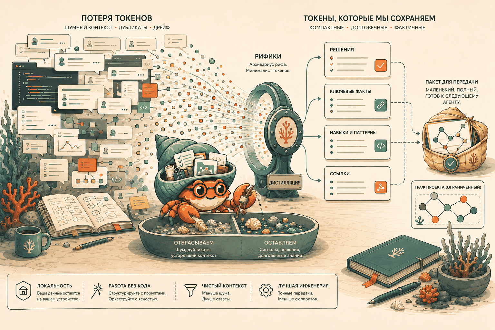

# REEFIKI


<p align="center">
  <a href="QUICKSTART.md#русский"></a>
  <a href="LICENSE"></a>
  <a href="#безопасность"></a>
  <a href="#для-агентов"></a>
  <a href="docs/PUBLIC_DEMO.md#русский"></a>
  <a href="COMMANDS.md#русский"></a>
</p>

AI-агенты быстро помогают, но плохо помнят контекст: решения остаются в чатах, полезные приемы теряются, а следующий агент снова начинает с нуля.

**REEFIKI** решает эту проблему как локальная вики-память для AI-агентов: она сохраняет не весь шум, а только то, что реально пригодится снова.

[English](README.en.md) · [中文](README.zh-CN.md) · [Быстрый старт](QUICKSTART.md#русский) · [Команды](COMMANDS.md#русский)

---

## Проблема

Работа с AI-агентами часто ломается не из-за кода, а из-за памяти.

После нескольких тредов появляются типичные проблемы:

- важное решение осталось в переписке и больше не находится;
- новый агент не знает, почему проект устроен именно так;
- полезный прием был найден один раз, но не стал повторяемым навыком;
- ссылки, заметки и выводы смешиваются с черновиками и шумом;
- память агента становится либо слишком короткой, либо слишком грязной.

Обычная база заметок тоже не решает это полностью: туда легко складывать все подряд, но трудно отделять reusable knowledge от случайного контекста.

## Что Такое REEFIKI

REEFIKI это локальная multi-project distillation wiki для AI-агентов.

Проще:

- у каждого проекта есть своя вики;
- агент сохраняет туда решения, навыки, выводы и источники;
- слабые или временные материалы откладываются, а не засоряют базу;
- все хранится в markdown-файлах и git-истории;
- правила работы описаны в `AGENTS.md`, поэтому их понимают разные агенты.

REEFIKI не пытается быть еще одним чат-ботом, облачной памятью или складом всех сообщений. Это фильтр, который превращает рабочий хаос в короткую, проверяемую и переносимую память проекта.

## Типы Проектов

Не все REEFIKI-проекты одинаковые. При создании или подключении проекта можно сразу сказать агенту, какой это профиль:

| Профиль | Для чего | Примеры |
|---|---|---|
| `agent_surface` | правила, skills, adapters, diagnostics и recovery для agent/IDE/runtime окружений | Codex, Claude Code, Gemini, Mimo, Hermes |
| `product` | продуктовые решения, delivery evidence, UX и release knowledge | Metrica |
| `knowledge_domain` | предметная база знаний без основного runtime-слоя | Suno, Instagram, Security Guidance |
| `reefiki_core` | правила и governance самого REEFIKI | reefiki |

Это ручной onboarding label, а не обязательное поле схемы. Подробно: [docs/PROJECT_PROFILES.md](docs/PROJECT_PROFILES.md#русский).

## Зачем Он Нужен

REEFIKI полезен, если ты работаешь с AI-агентами регулярно и хочешь, чтобы они:

- продолжали работу с учетом прошлых решений;
- не повторяли уже пройденные ошибки;
- быстро поднимали проектный контекст;
- сохраняли процедуры как навыки;
- разделяли личную/private память и публичные материалы;
- передавали работу между Codex, Claude Code, Cursor, Windsurf и другими агентами.

Главная идея: **агент должен не просто выполнить задачу, а оставить после себя пригодный след**.

## Как Это Работает


REEFIKI использует простой цикл:

1. **Собрать**: ссылка, файл, решение или вывод попадает в копилку проекта.
2. **Отфильтровать**: агент проверяет, можно ли это применить снова.
3. **Сохранить**: полезное становится страницей вики, навыком, решением или synthesis.
4. **Связать**: страницы получают связи, индекс и запись в журнале.
5. **Поднять позже**: следующий агент отвечает уже из накопленной вики, а не из догадок.

Внутри REEFIKI есть несколько типов памяти:

| Тип | Что сохраняет |
|---|---|
| `sources` | откуда пришла идея или материал |
| `concepts` | reusable-понимание |
| `decisions` | принятое решение и причина |
| `skills` | воспроизводимая процедура |
| `synthesis` | выводы из сессии или этапа работы |

## Рифик


Рифик это маленький reef crab archivist: хранитель рифа-вики, который не тащит в память весь песок, а отбирает только полезные ракушки. В README он работает как метафора: слева шум сессий, в центре дистилляция, справа аккуратная проектная память.

## Быстрый Старт

Самый короткий безопасный первый запуск через CLI: установить, создать локальный workspace, проверить здоровье проекта, потом уже смотреть демо или подключать реальный код.

```powershell
pipx install git+https://github.com/kisslex2013-alt/reefiki.git
pipx ensurepath
Get-Command reefiki
where.exe reefiki
reefiki --help
reefiki init --workspace C:\Temp\reefiki-workspace --project-name first-run --format json
reefiki --project C:\Temp\reefiki-workspace\projects\first-run doctor --format json
reefiki --project C:\Temp\reefiki-workspace\projects\first-run status
reefiki onboarding
```

POSIX пример:

```bash
python3 -m pip install --user pipx
pipx install git+https://github.com/kisslex2013-alt/reefiki.git
pipx ensurepath
reefiki --help
reefiki init --workspace /tmp/reefiki-workspace --project-name first-run --format json
reefiki --project /tmp/reefiki-workspace/projects/first-run doctor --format json
reefiki --project /tmp/reefiki-workspace/projects/first-run status
reefiki onboarding --lang en
```

Если CLI ещё не установлен или `reefiki` не найден в текущем shell, тот же init-first путь работает из checkout:

```powershell
python scripts\reefiki.py init --workspace C:\Temp\reefiki-workspace --project-name first-run --format json
python scripts\reefiki.py --project C:\Temp\reefiki-workspace\projects\first-run doctor --format json
python scripts\reefiki.py --project C:\Temp\reefiki-workspace\projects\first-run status
```

После проверки можно посмотреть демо-экран:

```powershell
reefiki onboarding
reefiki onboarding --fixture-root C:\Temp\reefiki-demo
reefiki ops-dashboard demo --fixture-root C:\Temp\reefiki-dashboard-demo
reefiki ops-dashboard serve --workspace-root C:\Temp\reefiki-dashboard-demo --port 7310
```

Или подключить кодовый проект явно через bridge:

```powershell
reefiki init --workspace C:\Temp\my-reefiki --project-name my-app --code-project H:\Projects\MyApp --apply-bridge --format json
reefiki connect-check H:\Projects\MyApp --format json
```

Без `--apply-bridge` команда не пишет `.reefiki` и `_wiki/` в кодовый проект.

Если хочешь, чтобы агент сделал это за тебя, открой REEFIKI и скажи:

```text
Подключи проект H:\Projects\MyApp к вики
```

После этого можно работать обычными фразами:

| Ты говоришь | Что делает агент |
|---|---|
| "положи это в копилку" | сохраняет материал на разбор |
| "разбери копилку" | превращает полезное в wiki-страницы |
| "запомни это как решение" | сохраняет durable decision |
| "сохрани как навык" | оформляет повторяемую процедуру |
| "что мы решали про sync?" | отвечает только из накопленной вики |
| "зафиксируй выводы сессии" | сохраняет synthesis |

Подробный первый запуск: [QUICKSTART.md](QUICKSTART.md#русский). Установка и fallback: [docs/INSTALL.md](docs/INSTALL.md#русский).

## Что Уже Умеет

- Отдельные wiki-проекты в `projects/<name>/`.
- Подключение существующего кодового проекта через `_wiki`.
- Capture -> process -> query -> harvest workflow.
- Agent-agnostic правила через `AGENTS.md`.
- Ручные project profiles для agent/runtime, product и knowledge-domain проектов.
- Локальные markdown-файлы вместо закрытого облачного storage.
- Журнал изменений и индекс вики.
- Health/lint проверки, чтобы база не превращалась в свалку.
- Handoff context для следующего агента.
- Явные границы между локальной/private памятью и материалами, которые можно публиковать.

Полная карта возможностей: [COMMANDS.md](COMMANDS.md#русский).

## Что REEFIKI Не Делает

REEFIKI сознательно не является:

- хранилищем всех сообщений чата;
- заменой git, Obsidian или issue tracker;
- автоматическим облачным sync-сервисом;
- векторной базой "на всякий случай";
- системой, которая пишет в любую папку без project boundary.

Если материал нельзя применить снова, его лучше не сохранять в durable wiki.

## Безопасность

REEFIKI local-first by default:

- пользовательские wiki-проекты остаются локальными;
- `raw/` считается неизменяемым архивом;
- секреты, бинарники и слишком большие файлы не сохраняются автоматически;
- публичные материалы отделены от локальных wiki-проектов и проходят проверку перед публикацией;
- агент меняет только явно выбранные файлы в рамках проекта.

Коротко: REEFIKI делает память полезной, но не размывает границы проекта.

## Для Агентов

Агентам не нужно помнить внутренние команды. Они читают `AGENTS.md` и работают по проектному контракту:

- в корне REEFIKI можно создавать и подключать проекты;
- внутри `projects/<name>/` можно сохранять и разбирать знания;
- старые строки `wiki/log.md` не переписываются;
- `raw/` не редактируется;
- все durable writes должны быть объяснимыми и воспроизводимыми.

Это делает REEFIKI переносимым между Codex, Claude Code, Cursor, Windsurf/Cascade, Cline и другими LLM-агентами.

Если проект относится к agent/IDE/runtime окружению вроде Codex, Claude Code, Gemini, Mimo или Hermes, веди его как `agent_surface`: сохраняй переносимые процедуры, adapters, diagnostics и recovery notes, но не объединяй wikis и не копируй skills автоматически.

## Экономия Токенов



REEFIKI снижает расход токенов не магическим сжатием, а тем, что агент читает меньше мусора.

- Вместо всего чата поднимаются короткие страницы `decisions`, `skills`, `concepts` и `synthesis`.
- Проекты изолированы, поэтому агент не тащит чужой контекст в текущую задачу.
- `wiki/index.md` и журнал помогают найти нужные страницы без полного перечитывания базы.
- Handoff-пакет собирает ограниченный контекст для следующего агента.
- Слабые материалы остаются в копилке или отказе, а не попадают в постоянную память.

Ориентир, не гарантия: одна короткая `decision` или `skill`-страница обычно занимает примерно 500-2 000 токенов и часто заменяет 5 000-30 000 токенов старой переписки. Handoff-пакет обычно разумно держать в районе 2 000-8 000 токенов вместо десятков тысяч токенов истории.

На повторных задачах это часто даёт примерно 50-90% меньше токенов на чтение контекста; для точечного возврата к одному решению или навыку выигрыш может быть 70-95%.

Подробно: [docs/TOKEN_ECONOMY.md#русский](docs/TOKEN_ECONOMY.md#русский).

## Куда Дальше

- [QUICKSTART.md](QUICKSTART.md#русский): первый запуск без знания CLI.
- [COMMANDS.md](COMMANDS.md#русский): все операции REEFIKI.
- [docs/TOKEN_ECONOMY.md](docs/TOKEN_ECONOMY.md#русский): как REEFIKI экономит токены.
- [docs/INSTALL.md](docs/INSTALL.md#русский): установка и smoke-проверка CLI.
- [docs/obsidian-setup.md](docs/obsidian-setup.md#русский): безопасная настройка Obsidian.
- [docs/PUBLIC_DEMO.md](docs/PUBLIC_DEMO.md#русский): публичное демо и границы.
- [docs/RECOVERY.md](docs/RECOVERY.md#русский): восстановление после сбоев.

Публичный roadmap: [docs/PUBLIC_ROADMAP.md](docs/PUBLIC_ROADMAP.md#русский). Публичный backlog: [docs/PUBLIC_BACKLOG.md](docs/PUBLIC_BACKLOG.md#русский).

## License

Код REEFIKI: Apache License 2.0. См. [LICENSE](LICENSE).

Контент wiki-проектов принадлежит пользователю, который его создал или добавил.

## Благодарности и источники идей

REEFIKI написан как самостоятельная реализация. Перечисленные ниже материалы и инструменты не импортированы как кодовая база и не являются скопированным исходным кодом REEFIKI. Мы использовали их как источники идей, словаря, архитектурных принципов и рабочих ограничений.

- [Karpathy LLM Wiki gist](https://gist.github.com/karpathy/442a6bf555914893e9891c11519de94f): идея компактной, читаемой агентом wiki вместо бесконечного пересказа чатов; фокус на distillation, а не на сыром архивировании.
- REEF protocol: цикл `capture -> distillation -> telemetry`; разделение дешёвого сохранения, осмысленной переработки и последующего использования.
- [Vannevar Bush, "As We May Think"](https://www.w3.org/History/1945/vbush/vbush.shtml): Memex, ассоциативные тропы, личная долговременная память и связанная база знаний вместо одиночных заметок.
- [Markdown wiki и Obsidian-подход](https://obsidian.md/help/links): локальные markdown-файлы, wikilinks, graph/viewer-мышление и возможность читать знания без облачного сервиса. REEFIKI не является клоном Obsidian: source of truth остаётся в репозитории и agent-aware правилах.
- [Git worktree workflow](https://git-scm.com/docs/git-worktree): идея изолированной работы над задачами, reviewable изменений и аккуратного разделения локального/private контента от публичного snapshot.
- [`memoir`](https://www.memoir-ai.dev/): короткая рабочая память и preferences как отдельный слой. В REEFIKI это optional short-memory provider; durable truth остаётся в markdown wiki.
- [Graphify](https://graphify.net/) и graph-based retrieval: граф структуры кода, файлов и документов как слой навигации и candidate selection. REEFIKI не становится graph database, а использует graph-подход для поиска связей и компактного контекста.
- [CodeGraph-style navigation](https://github.com/CodeGraphContext/CodeGraphContext): одноразовые impact/callgraph/relationship-запросы по коду как помощник разработчика, не как долговременная память.
- Agent/IDE runtimes: Codex, Claude Code, Cursor, Windsurf/Cascade, Cline, Gemini, Mimo и Hermes повлияли на vendor-neutral `AGENTS.md`, project profiles, portable rules и переносимые runbooks.
- Local-first security practice: явные project boundaries, проверка публичных материалов, append-only logs, immutable `raw/` и отказ от широкого сохранения всего подряд как REEFIKI-specific safety layer.

Итоговая идея REEFIKI: соединить wiki, agent workflow, short memory, graph navigation и Git discipline в один local-first процесс, где знания можно проверить, перенести и безопасно опубликовать.
